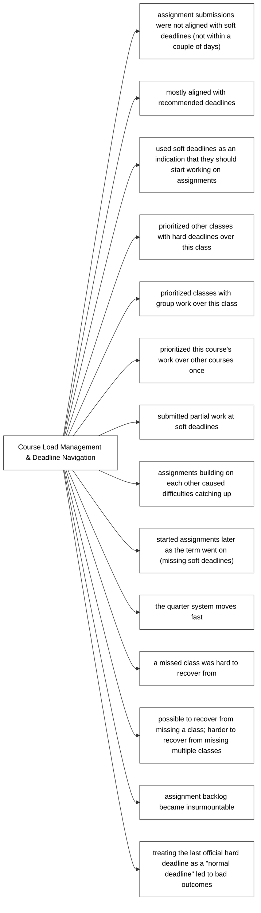

# Course Load Management & Deadline Navigation

```mermaid
flowchart LR

classDef basic fill:#ffffff,stroke:#333333,color:#000000;

%% COURSE LOAD MANAGEMENT & DEADLINE NAVIGATION
CLMDN["Course Load Management &amp; Deadline Navigation"]
class CLMDN basic

CLMDN --> CLMDN1["assignment submissions were not aligned with soft deadlines (not within a couple of days)"]
CLMDN --> CLMDN2["mostly aligned with recommended deadlines"]
CLMDN --> CLMDN3["used soft deadlines as an indication that they should start working on assignments"]
CLMDN --> CLMDN4["prioritized other classes with hard deadlines over this class"]
CLMDN --> CLMDN5["prioritized classes with group work over this class"]
CLMDN --> CLMDN6["prioritized this course's work over other courses once"]
CLMDN --> CLMDN7["submitted partial work at soft deadlines"]
CLMDN --> CLMDN8["assignments building on each other caused difficulties catching up"]
CLMDN --> CLMDN9["started assignments later as the term went on (missing soft deadlines)"]
CLMDN --> CLMDN10["the quarter system moves fast"]
CLMDN --> CLMDN11["a missed class was hard to recover from"]
CLMDN --> CLMDN12["possible to recover from missing a class; harder to recover from missing multiple classes"]
CLMDN --> CLMDN13["assignment backlog became insurmountable"]
CLMDN --> CLMDN14["treating the last official hard deadline as a #quot;normal deadline#quot; led to bad outcomes"]

class CLMDN,CLMDN1,CLMDN2,CLMDN3,CLMDN4,CLMDN5,CLMDN6,CLMDN7,CLMDN8,CLMDN9,CLMDN10,CLMDN11,CLMDN12,CLMDN13,CLMDN14 basic
```