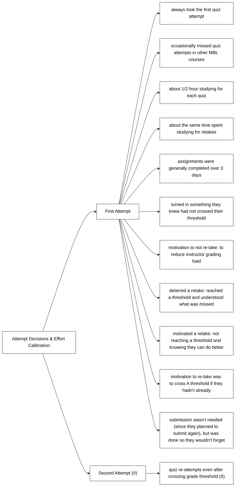

# Attempt Decisions & Effort Calibration

```mermaid
flowchart LR

classDef basic fill:#ffffff,stroke:#333333,color:#000000;

%% ATTEMPT DECISIONS & EFFORT CALIBRATION
ADEC["Attempt Decisions &amp; Effort Calibration"]
class ADEC basic

ADEC --> ADEC_F["First Attempt"]
ADEC_F --> ADEC_F1["always took the first quiz attempt"]
ADEC_F --> ADEC_F2["occasionally missed quiz attempts in other MBL courses"]
ADEC_F --> ADEC_F3["about 1/2 hour studying for each quiz"]
ADEC_F --> ADEC_F4["about the same time spent studying for retakes"]
ADEC_F --> ADEC_F5["assignments were generally completed over 3 days"]
ADEC_F --> ADEC_F6["turned in something they knew had not crossed their threshold"]
ADEC_F --> ADEC_F7["motivation to not re-take: to reduce instructor grading load"]
ADEC_F --> ADEC_F8["deterred a retake: reached a threshold and understood what was missed"]
ADEC_F --> ADEC_F9["motivated a retake: not reaching a threshold and knowing they can do better"]
ADEC_F --> ADEC_F10["motivation to re-take was to cross A threshold if they hadn't already"]
ADEC_F --> ADEC_F11["submission wasn't needed (since they planned to submit again), but was done so they wouldn't forget"]
ADEC --> ADEC_S["Second Attempt (II)"]
ADEC_S --> ADEC_S1["quiz re-attempts even after crossing grade threshold (II)"]

class ADEC,ADEC_F,ADEC_F1,ADEC_F2,ADEC_F3,ADEC_F4,ADEC_F5,ADEC_F6,ADEC_F7,ADEC_F8,ADEC_F9,ADEC_F10,ADEC_F11,ADEC_S,ADEC_S1 basic
```