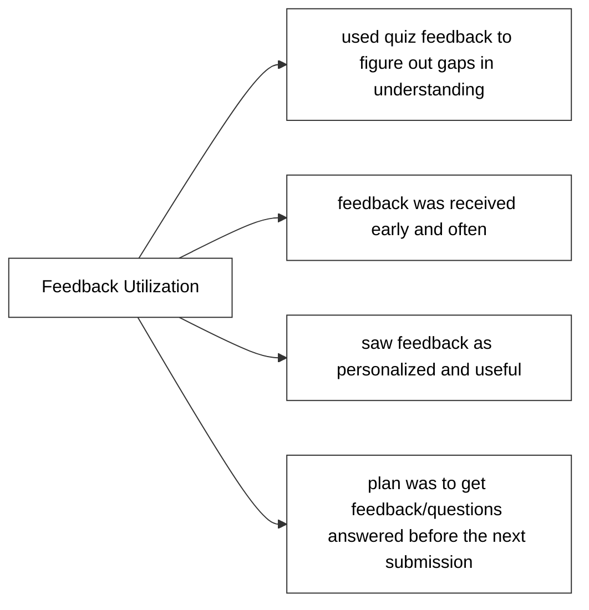

# Feedback Utilization

```mermaid
flowchart LR

classDef basic fill:#ffffff,stroke:#333333,color:#000000;

%% FEEDBACK UTILIZATION
FU["Feedback Utilization"]
class FU basic

FU --> FU1["used quiz feedback to figure out gaps in understanding"]
FU --> FU2["feedback was received early and often"]
FU --> FU3["saw feedback as personalized and useful"]
FU --> FU4["plan was to get feedback/questions answered before the next submission"]

class FU,FU1,FU2,FU3,FU4 basic
```