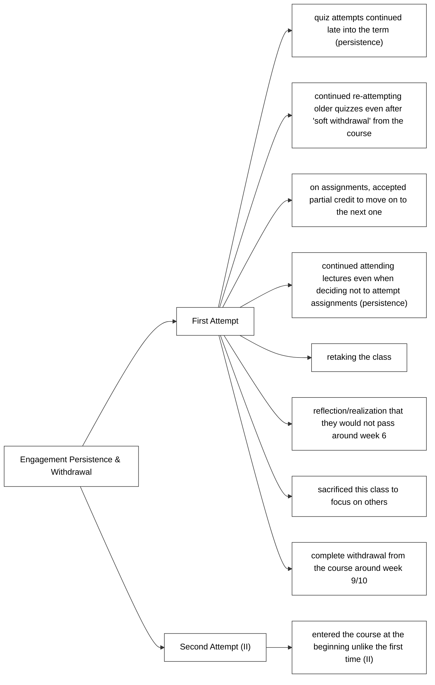

# Engagement Persistence & Withdrawal

```mermaid
flowchart LR

classDef basic fill:#ffffff,stroke:#333333,color:#000000;

%% ENGAGEMENT PERSISTENCE & WITHDRAWAL
EPW["Engagement Persistence &amp; Withdrawal"]
class EPW basic

EPW --> EPW_F["First Attempt"]
EPW_F --> EPW_F1["quiz attempts continued late into the term (persistence)"]
EPW_F --> EPW_F2["continued re-attempting older quizzes even after 'soft withdrawal' from the course"]
EPW_F --> EPW_F3["on assignments, accepted partial credit to move on to the next one"]
EPW_F --> EPW_F4["continued attending lectures even when deciding not to attempt assignments (persistence)"]
EPW_F --> EPW_F5["retaking the class"]
EPW_F --> EPW_F6["reflection/realization that they would not pass around week 6"]
EPW_F --> EPW_F7["sacrificed this class to focus on others"]
EPW_F --> EPW_F8["complete withdrawal from the course around week 9/10"]
EPW --> EPW_S["Second Attempt (II)"]
EPW_S --> EPW_S1["entered the course at the beginning unlike the first time (II)"]

class EPW,EPW_F,EPW_F1,EPW_F2,EPW_F3,EPW_F4,EPW_F5,EPW_F6,EPW_F7,EPW_F8,EPW_S,EPW_S1 basic
```