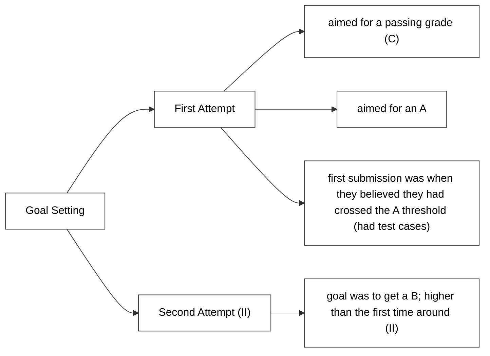

# Goal Setting

```mermaid
flowchart LR

classDef basic fill:#ffffff,stroke:#333333,color:#000000;

%% GOAL SETTING
GS["Goal Setting"]
class GS basic

GS --> GS_F["First Attempt"]
GS_F --> GS_F1["aimed for a passing grade (C)"]
GS_F --> GS_F2["aimed for an A"]
GS_F --> GS_F3["first submission was when they believed they had crossed the A threshold (had test cases)"]
GS --> GS_S["Second Attempt (II)"]
GS_S --> GS_S1["goal was to get a B; higher than the first time around (II)"]

class GS,GS_F,GS_F1,GS_F2,GS_F3,GS_S,GS_S1 basic
```