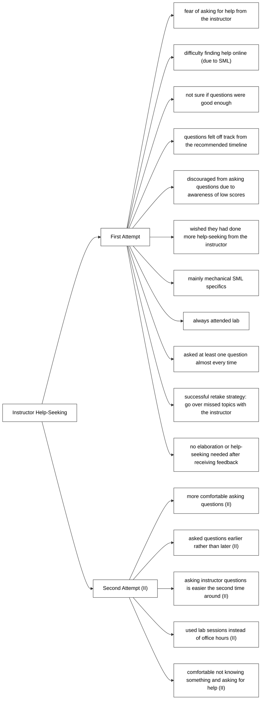

# Instructor Help-Seeking

```mermaid
flowchart LR

classDef basic fill:#ffffff,stroke:#333333,color:#000000;

%% INSTRUCTOR HELP-SEEKING
IH["Instructor Help-Seeking"]
class IH basic

IH --> IH_F["First Attempt"]
IH_F --> IH_F1["fear of asking for help from the instructor"]
IH_F --> IH_F2["difficulty finding help online (due to SML)"]
IH_F --> IH_F3["not sure if questions were good enough"]
IH_F --> IH_F4["questions felt off track from the recommended timeline"]
IH_F --> IH_F5["discouraged from asking questions due to awareness of low scores"]
IH_F --> IH_F6["wished they had done more help-seeking from the instructor"]
IH_F --> IH_F7["mainly mechanical SML specifics"]
IH_F --> IH_F8["always attended lab"]
IH_F --> IH_F9["asked at least one question almost every time"]
IH_F --> IH_F10["successful retake strategy: go over missed topics with the instructor"]
IH_F --> IH_F11["no elaboration or help-seeking needed after receiving feedback"]
IH --> IH_S["Second Attempt (II)"]
IH_S --> IH_S1["more comfortable asking questions (II)"]
IH_S --> IH_S2["asked questions earlier rather than later (II)"]
IH_S --> IH_S3["asking instructor questions is easier the second time around (II)"]
IH_S --> IH_S4["used lab sessions instead of office hours (II)"]
IH_S --> IH_S5["comfortable not knowing something and asking for help (II)"]

class IH,IH_F,IH_F1,IH_F2,IH_F3,IH_F4,IH_F5,IH_F6,IH_F7,IH_F8,IH_F9,IH_F10,IH_F11,IH_S,IH_S1,IH_S2,IH_S3,IH_S4,IH_S5 basic
```