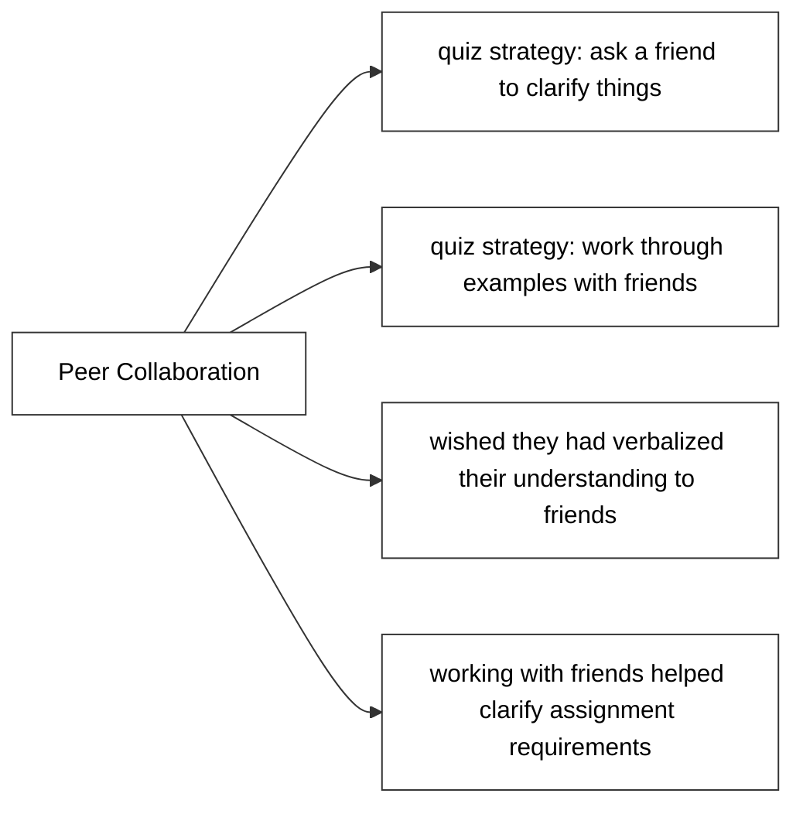

# Peer Collaboration

```mermaid
flowchart LR

classDef basic fill:#ffffff,stroke:#333333,color:#000000;

%% PEER COLLABORATION
PC["Peer Collaboration"]
class PC basic

PC --> PC1["quiz strategy: ask a friend to clarify things"]
PC --> PC2["quiz strategy: work through examples with friends"]
PC --> PC3["wished they had verbalized their understanding to friends"]
PC --> PC4["working with friends helped clarify assignment requirements"]

class PC,PC1,PC2,PC3,PC4 basic
```