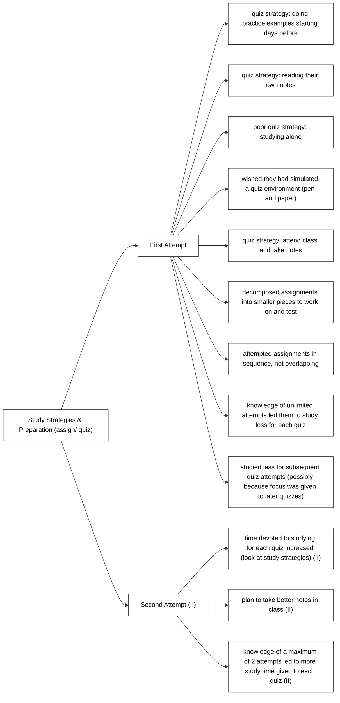

# Study Strategies & Preparation (assign/ quiz)

```mermaid
flowchart LR

classDef basic fill:#ffffff,stroke:#333333,color:#000000;

%% STUDY STRATEGIES & PREPARATION (ASSIGN/ QUIZ)
SSPAQ["Study Strategies &amp; Preparation (assign/ quiz)"]
class SSPAQ basic

SSPAQ --> SSPAQ_F["First Attempt"]
SSPAQ_F --> SSPAQ_F1["quiz strategy: doing practice examples starting days before"]
SSPAQ_F --> SSPAQ_F2["quiz strategy: reading their own notes"]
SSPAQ_F --> SSPAQ_F3["poor quiz strategy: studying alone"]
SSPAQ_F --> SSPAQ_F4["wished they had simulated a quiz environment (pen and paper)"]
SSPAQ_F --> SSPAQ_F5["quiz strategy: attend class and take notes"]
SSPAQ_F --> SSPAQ_F6["decomposed assignments into smaller pieces to work on and test"]
SSPAQ_F --> SSPAQ_F7["attempted assignments in sequence, not overlapping"]
SSPAQ_F --> SSPAQ_F8["knowledge of unlimited attempts led them to study less for each quiz"]
SSPAQ_F --> SSPAQ_F9["studied less for subsequent quiz attempts (possibly because focus was given to later quizzes)"]
SSPAQ --> SSPAQ_S["Second Attempt (II)"]
SSPAQ_S --> SSPAQ_S1["time devoted to studying for each quiz increased (look at study strategies) (II)"]
SSPAQ_S --> SSPAQ_S2["plan to take better notes in class (II)"]
SSPAQ_S --> SSPAQ_S3["knowledge of a maximum of 2 attempts led to more study time given to each quiz (II)"]

class SSPAQ,SSPAQ_F,SSPAQ_F1,SSPAQ_F2,SSPAQ_F3,SSPAQ_F4,SSPAQ_F5,SSPAQ_F6,SSPAQ_F7,SSPAQ_F8,SSPAQ_F9,SSPAQ_S,SSPAQ_S1,SSPAQ_S2,SSPAQ_S3 basic
```