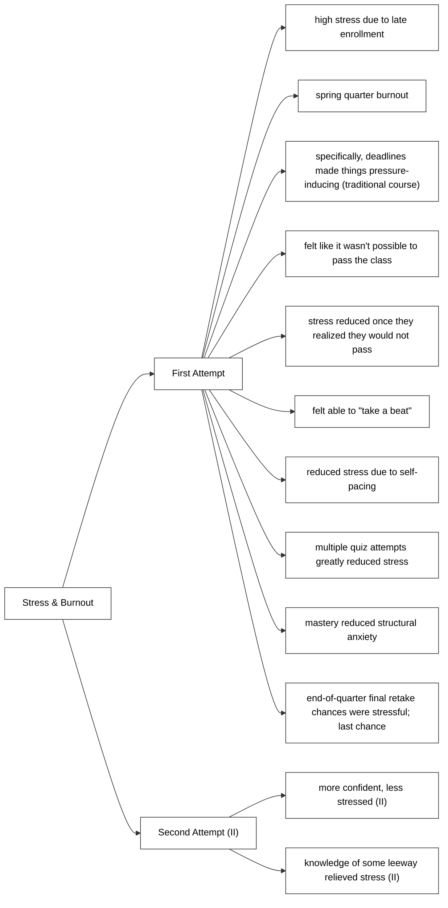

# Stress & Burnout

```mermaid
flowchart LR

classDef basic fill:#ffffff,stroke:#333333,color:#000000;

%% STRESS & BURNOUT
SB["Stress &amp; Burnout"]
class SB basic

SB --> SB_F["First Attempt"]
SB_F --> SB_F1["high stress due to late enrollment"]
SB_F --> SB_F2["spring quarter burnout"]
SB_F --> SB_F3["specifically, deadlines made things pressure-inducing (traditional course)"]
SB_F --> SB_F4["felt like it wasn't possible to pass the class"]
SB_F --> SB_F5["stress reduced once they realized they would not pass"]
SB_F --> SB_F6["felt able to #quot;take a beat#quot;"]
SB_F --> SB_F7["reduced stress due to self-pacing"]
SB_F --> SB_F8["multiple quiz attempts greatly reduced stress"]
SB_F --> SB_F9["mastery reduced structural anxiety"]
SB_F --> SB_F10["end-of-quarter final retake chances were stressful; last chance"]
SB --> SB_S["Second Attempt (II)"]
SB_S --> SB_S1["more confident, less stressed (II)"]
SB_S --> SB_S2["knowledge of some leeway relieved stress (II)"]

class SB,SB_F,SB_F1,SB_F2,SB_F3,SB_F4,SB_F5,SB_F6,SB_F7,SB_F8,SB_F9,SB_F10,SB_S,SB_S1,SB_S2 basic
```