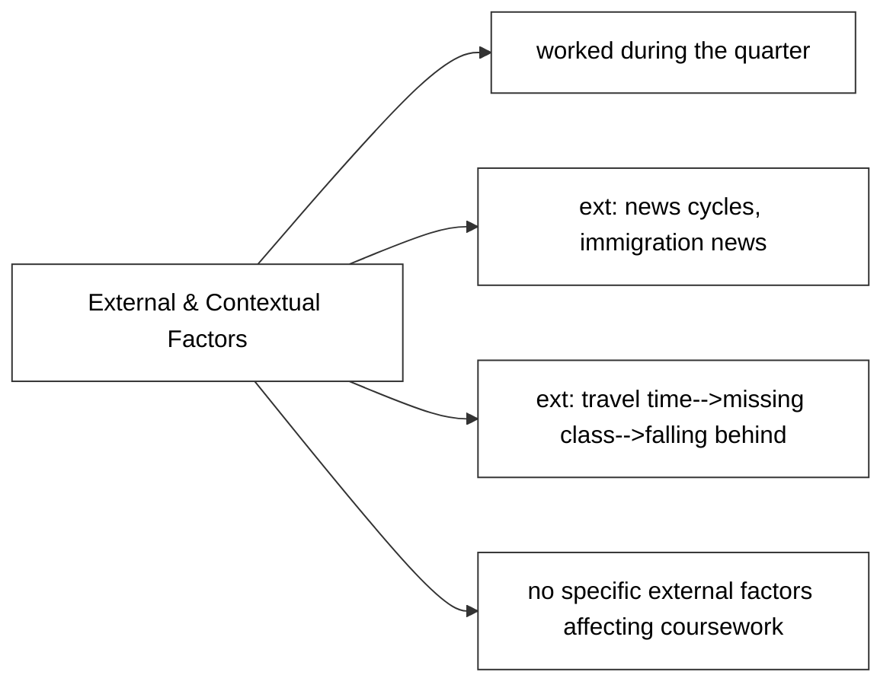

# External & Contextual Factors

```mermaid
flowchart LR

classDef basic fill:#ffffff,stroke:#333333,color:#000000;

%% EXTERNAL & CONTEXTUAL FACTORS
ECF["External &amp; Contextual Factors"]
class ECF basic

ECF --> ECF1["worked during the quarter"]
ECF --> ECF2["ext: news cycles, immigration news"]
ECF --> ECF3["ext: travel time-->missing class-->falling behind"]
ECF --> ECF4["no specific external factors affecting coursework"]

class ECF,ECF1,ECF2,ECF3,ECF4 basic
```