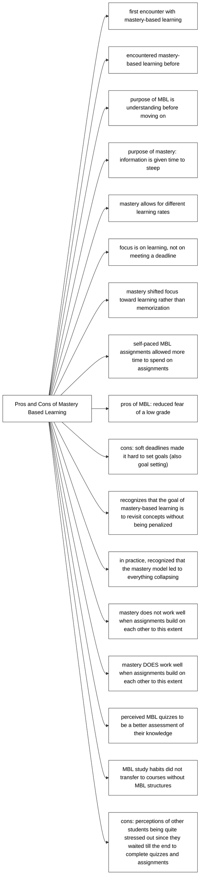

# Pros and Cons of Mastery Based Learning

```mermaid
flowchart LR

classDef basic fill:#ffffff,stroke:#333333,color:#000000;

%% PROS AND CONS OF MASTERY BASED LEARNING
PACOM["Pros and Cons of Mastery Based Learning"]
class PACOM basic

PACOM --> PACOM1["first encounter with mastery-based learning"]
PACOM --> PACOM2["encountered mastery-based learning before"]
PACOM --> PACOM3["purpose of MBL is understanding before moving on"]
PACOM --> PACOM4["purpose of mastery: information is given time to steep"]
PACOM --> PACOM5["mastery allows for different learning rates"]
PACOM --> PACOM6["focus is on learning, not on meeting a deadline"]
PACOM --> PACOM7["mastery shifted focus toward learning rather than memorization"]
PACOM --> PACOM8["self-paced MBL assignments allowed more time to spend on assignments"]
PACOM --> PACOM9["pros of MBL: reduced fear of a low grade"]
PACOM --> PACOM10["cons: soft deadlines made it hard to set goals (also goal setting)"]
PACOM --> PACOM11["recognizes that the goal of mastery-based learning is to revisit concepts without being penalized"]
PACOM --> PACOM12["in practice, recognized that the mastery model led to everything collapsing"]
PACOM --> PACOM13["mastery does not work well when assignments build on each other to this extent"]
PACOM --> PACOM14["mastery DOES work well when assignments build on each other to this extent"]
PACOM --> PACOM15["perceived MBL quizzes to be a better assessment of their knowledge"]
PACOM --> PACOM16["MBL study habits did not transfer to courses without MBL structures"]
PACOM --> PACOM17["cons: perceptions of other students being quite stressed out since they waited till the end to complete quizzes and assignments"]

class PACOM,PACOM1,PACOM2,PACOM3,PACOM4,PACOM5,PACOM6,PACOM7,PACOM8,PACOM9,PACOM10,PACOM11,PACOM12,PACOM13,PACOM14,PACOM15,PACOM16,PACOM17 basic
```