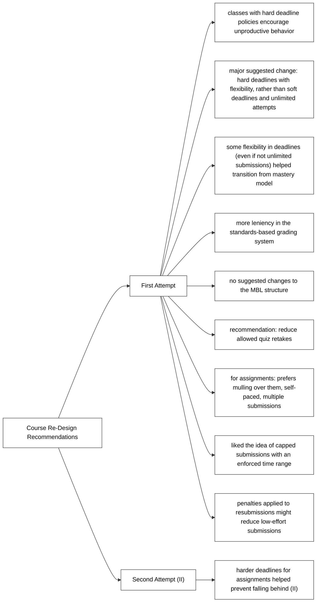

# Course Re-Design Recommendations

```mermaid
flowchart LR

classDef basic fill:#ffffff,stroke:#333333,color:#000000;

%% COURSE RE-DESIGN RECOMMENDATIONS
CRR["Course Re-Design Recommendations"]
class CRR basic

CRR --> CRR_F["First Attempt"]
CRR_F --> CRR_F1["classes with hard deadline policies encourage unproductive behavior"]
CRR_F --> CRR_F2["major suggested change: hard deadlines with flexibility, rather than soft deadlines and unlimited attempts"]
CRR_F --> CRR_F3["some flexibility in deadlines (even if not unlimited submissions) helped transition from mastery model"]
CRR_F --> CRR_F4["more leniency in the standards-based grading system"]
CRR_F --> CRR_F5["no suggested changes to the MBL structure"]
CRR_F --> CRR_F6["recommendation: reduce allowed quiz retakes"]
CRR_F --> CRR_F7["for assignments: prefers mulling over them, self-paced, multiple submissions"]
CRR_F --> CRR_F8["liked the idea of capped submissions with an enforced time range"]
CRR_F --> CRR_F9["penalties applied to resubmissions might reduce low-effort submissions"]
CRR --> CRR_S["Second Attempt (II)"]
CRR_S --> CRR_S1["harder deadlines for assignments helped prevent falling behind (II)"]

class CRR,CRR_F,CRR_F1,CRR_F2,CRR_F3,CRR_F4,CRR_F5,CRR_F6,CRR_F7,CRR_F8,CRR_F9,CRR_S,CRR_S1 basic
```