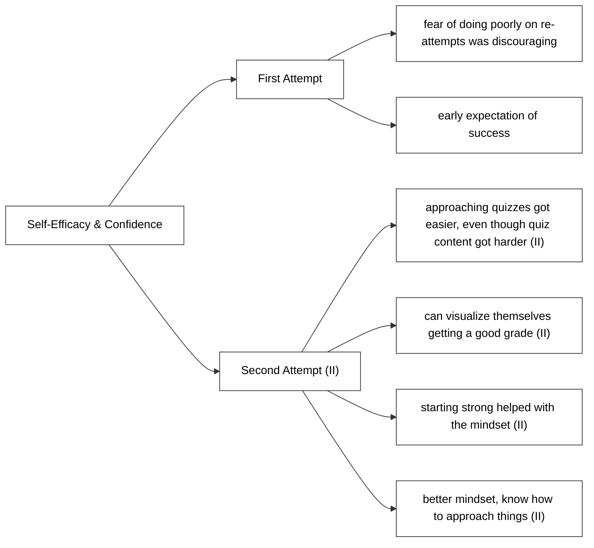

# Self-Efficacy & Confidence

```mermaid
flowchart LR

classDef basic fill:#ffffff,stroke:#333333,color:#000000;

%% SELF-EFFICACY & CONFIDENCE
SC["Self-Efficacy &amp; Confidence"]
class SC basic

SC --> SC_F["First Attempt"]
SC_F --> SC_F1["fear of doing poorly on re-attempts was discouraging"]
SC_F --> SC_F2["early expectation of success"]
SC --> SC_S["Second Attempt (II)"]
SC_S --> SC_S1["approaching quizzes got easier, even though quiz content got harder (II)"]
SC_S --> SC_S2["can visualize themselves getting a good grade (II)"]
SC_S --> SC_S3["starting strong helped with the mindset (II)"]
SC_S --> SC_S4["better mindset, know how to approach things (II)"]

class SC,SC_F,SC_F1,SC_F2,SC_S,SC_S1,SC_S2,SC_S3,SC_S4 basic
```