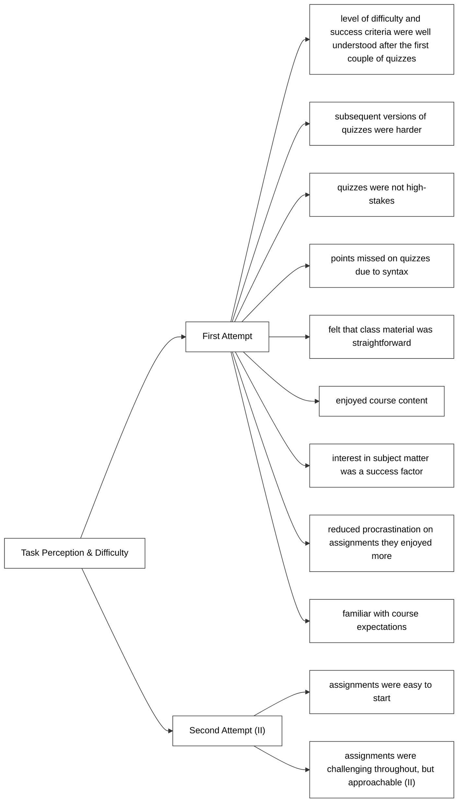

# Task Perception & Difficulty

```mermaid
flowchart LR

classDef basic fill:#ffffff,stroke:#333333,color:#000000;

%% TASK PERCEPTION & DIFFICULTY
TPD["Task Perception &amp; Difficulty"]
class TPD basic

TPD --> TPD_F["First Attempt"]
TPD_F --> TPD_F1["level of difficulty and success criteria were well understood after the first couple of quizzes"]
TPD_F --> TPD_F2["subsequent versions of quizzes were harder"]
TPD_F --> TPD_F3["quizzes were not high-stakes"]
TPD_F --> TPD_F4["points missed on quizzes due to syntax"]
TPD_F --> TPD_F5["felt that class material was straightforward"]
TPD_F --> TPD_F6["enjoyed course content"]
TPD_F --> TPD_F7["interest in subject matter was a success factor"]
TPD_F --> TPD_F8["reduced procrastination on assignments they enjoyed more"]
TPD_F --> TPD_F9["familiar with course expectations"]
TPD --> TPD_S["Second Attempt (II)"]
TPD_S --> TPD_S1["assignments were easy to start"]
TPD_S --> TPD_S2["assignments were challenging throughout, but approachable (II)"]

class TPD,TPD_F,TPD_F1,TPD_F2,TPD_F3,TPD_F4,TPD_F5,TPD_F6,TPD_F7,TPD_F8,TPD_F9,TPD_S,TPD_S1,TPD_S2 basic
```