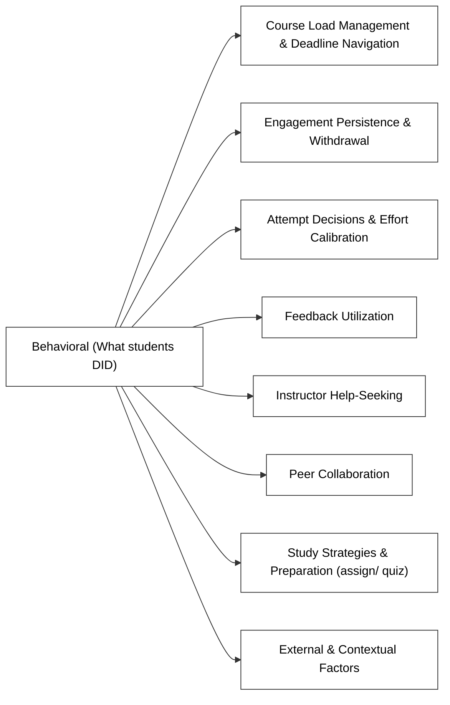

# Behavioral (What students DID)

```mermaid
flowchart LR

classDef basic fill:#ffffff,stroke:#333333,color:#000000;

%% BEHAVIORAL (WHAT STUDENTS DID)
BWSD["Behavioral (What students DID)"]
class BWSD basic

BWSD --> CLMDN["Course Load Management &amp; Deadline Navigation"]
class CLMDN basic
BWSD --> EPW["Engagement Persistence &amp; Withdrawal"]
class EPW basic
BWSD --> ADEC["Attempt Decisions &amp; Effort Calibration"]
class ADEC basic
BWSD --> FU["Feedback Utilization"]
class FU basic
BWSD --> IH["Instructor Help-Seeking"]
class IH basic
BWSD --> PC["Peer Collaboration"]
class PC basic
BWSD --> SSPAQ["Study Strategies &amp; Preparation (assign/ quiz)"]
class SSPAQ basic
BWSD --> ECF["External &amp; Contextual Factors"]
class ECF basic

class BWSD basic
```