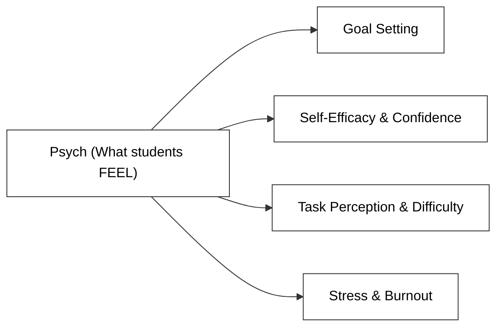

# Psych (What students FEEL)

```mermaid
flowchart LR

classDef basic fill:#ffffff,stroke:#333333,color:#000000;

%% PSYCH (WHAT STUDENTS FEEL)
PWSF["Psych (What students FEEL)"]
class PWSF basic

PWSF --> GS["Goal Setting"]
class GS basic
PWSF --> SC["Self-Efficacy &amp; Confidence"]
class SC basic
PWSF --> TPD["Task Perception &amp; Difficulty"]
class TPD basic
PWSF --> SB["Stress &amp; Burnout"]
class SB basic

class PWSF basic
```