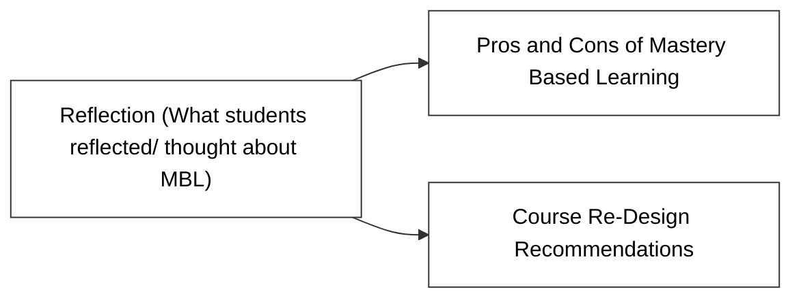

# Reflection (What students reflections/ thoughts about MBL)

```mermaid
flowchart LR

classDef basic fill:#ffffff,stroke:#333333,color:#000000;

%% REFLECTION (WHAT STUDENTS REFLECTIONS/ THOUGHTS ABOUT MBL)
RWSR["Reflection (What students reflected/ thought about MBL)"]
class RWSR basic

RWSR --> PACOM["Pros and Cons of Mastery Based Learning"]
class PACOM basic
RWSR --> CRR["Course Re-Design Recommendations"]
class CRR basic

class RWSR basic
```